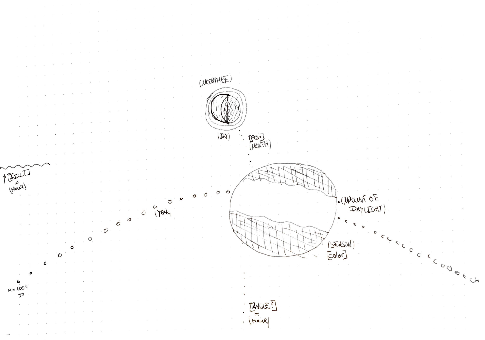
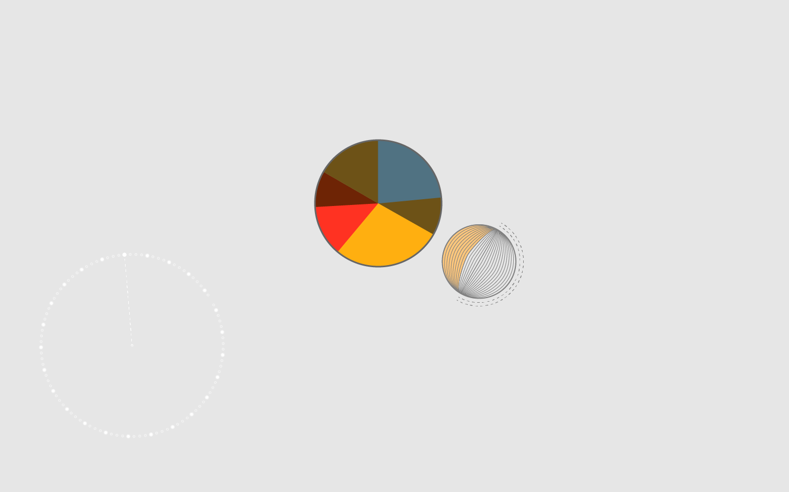
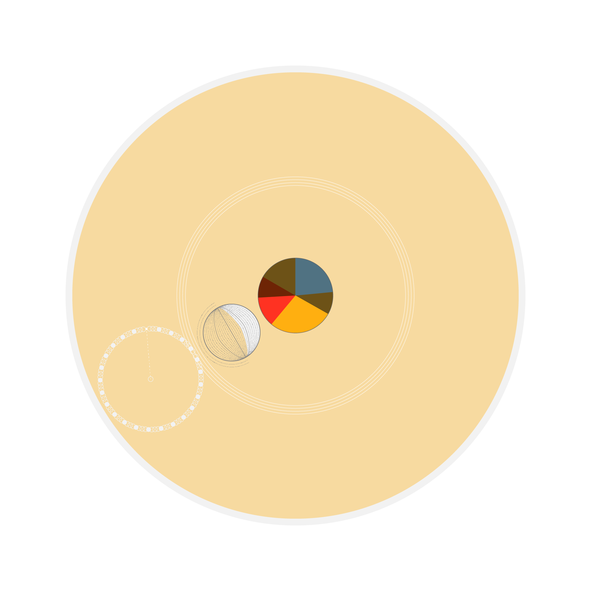
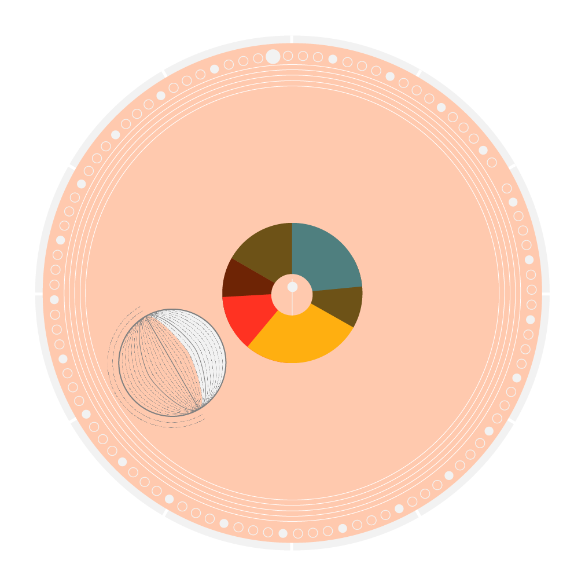
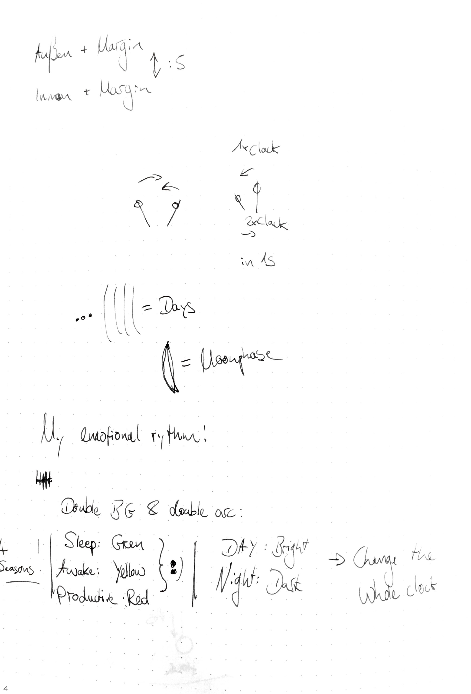
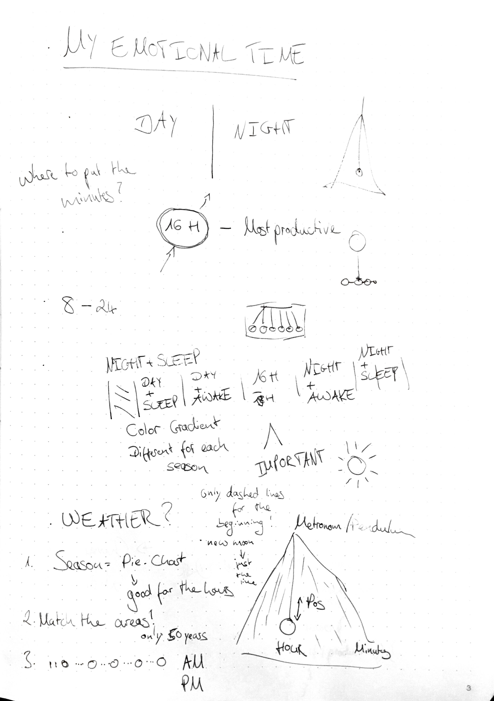

# My seasonal rhythm

For the “Right twice a day” assignment I wanted to create a clock that relates to my personal perception of time. In the last years I realized that my emotional state is stronger affected by outside factors like the season, the sunlight hours per day and the weather. Hence I decided to create a clock that puts a strong visual emphasis on factors I attribute the strongest effects to my emotional state to. Collateral damage to this emphasis is the easiness to read some of the encoded time measures and it collides with the magnitude of the time measures. A rule of thumb was: The more central a time measure is visualized the more important it is.

## Reading the clock

This is an attempt to explain how to read it from outermost to innermost radius:

1. The outmost circle is just a **reference** dial, in 30° steps (12 ticks).
2. A circle of 100 circles representing the **century** (I might want to extend this to 120 years for better match with the outer ticks).
    1. The first year of the century is indicated by a stronger stroke and a darker shade (for both: fill and stoke).
        2. The position of the first year of the century indicates the **current month**.
    2. Every leap year has a fill, regular years only a stroke
    3. The **current year** is indicated by a gap in the circle of years
3. The third position is a score (this is not implemented yet).
    1. Every **minute** another note is added on the angle (60 ticks).
    2. The score varies depending on the season or the month, my very first idea for the clock was to visualize Antonio Vivaldi’s _The Four Seasons (Le quattro stagioni)_, which would match since it’s four concerti with three movements each. The score could just repeat or restart for example at the wake up time.
4. Fourth is a representation of the month. The **lunar phase** is visualized as a filled shape over bezier curve strokes counting the **days of the month** (here I want to add a stronger weight for the strokes for every 7th stroke to facilitate the counting).
    1. The position of this “moon” indicates the **hour**.
5. The donut is a pie chart of my **daily rhythm**: I color encoded my sleep and awake phases as well as the time of the day I’m usually most productive. It has an overlay dimming the colors according to the **day / night shift**.
    1. The clock is affected by the current sleep / awake / productive state and the night shift. The background of the whole canvas is only affected by the night shift
    2. The color encoding of these three states varies over the year. Currently there is one theme for each **season**, maybe the colors could change gradually too.
6.  Inside the donut hole there is a metronome oscillating as a reminder that every single **second** or moment counts and not to be to affected by all the circumstances too much.

## My process

