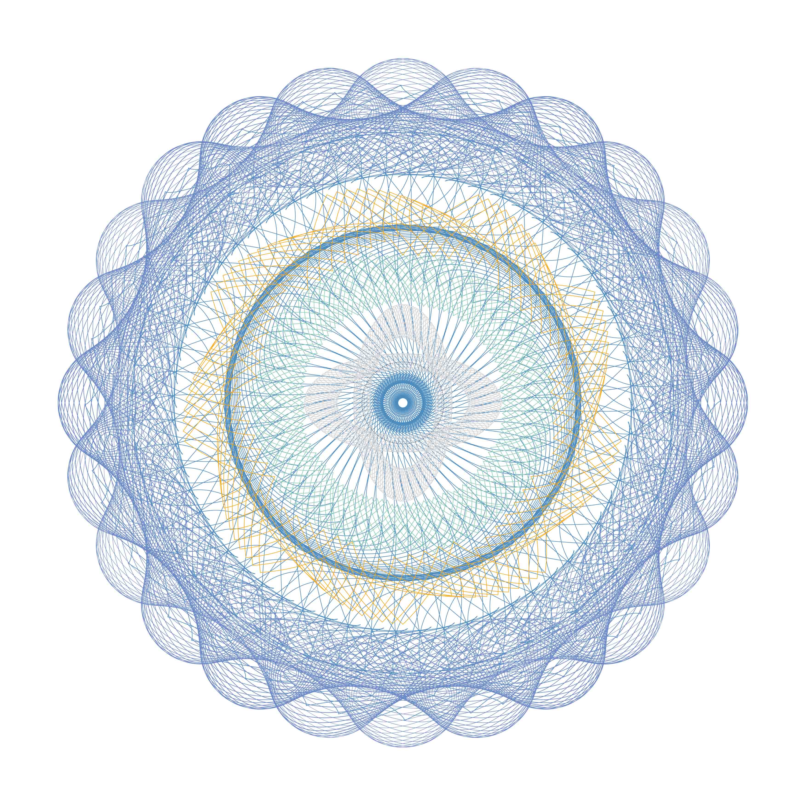
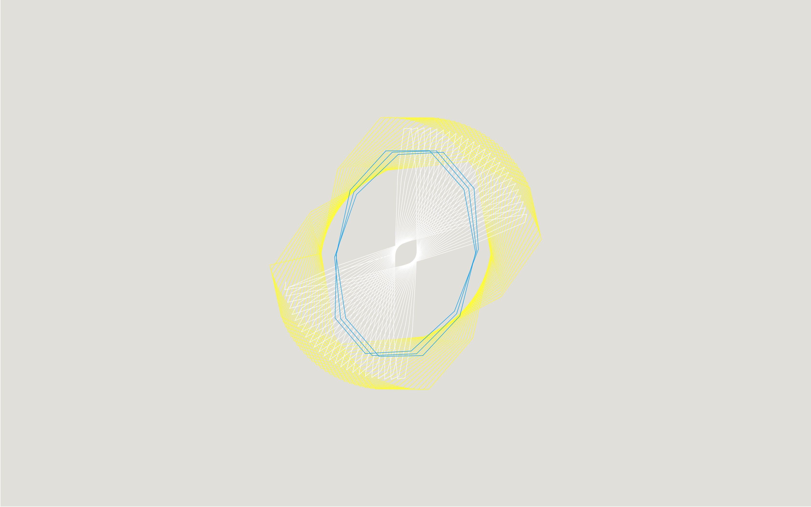

# Poly Spriograph, a simple guilloché clock

I love Guilloché patterns!

Image found here: _[https://www.cslabels.co.uk/guilloche.html](https://www.cslabels.co.uk/guilloche.html)_

This clock is an attempt to create a simple pattern using the spirograph principle. Since my current version still includes a few glitches and is still work in process, I decided to go for drawing the spirographs less smooth and use a more polygonal style and brighter colors.

My resources are:

- [wikipedia:Spirograph](https://en.wikipedia.org/wiki/Spirograph)
- [reddit:Periodicity of a spirograph](https://www.reddit.com/r/math/comments/27nz3l/how_do_i_calculate_the_periodicity_of_a/)
- [github:etra0/.block/Spirograph on p5js](https://gist.github.com/etra0/1c214bb4e39a68d05a924e0466454456), license: gpl-3.0

## Screenshot

_2018-09-26 at 11.48.08_

## Reading the clock

1. The revolutions of the spirograph with the white lines represent the current seconds.
2. The yellow spirograph indicates the minutes.
3. The blue spirograph represents the hours (24h).

## How to continue

- Remove the glitches because of the arbitrary starting point of the line.
- Work more consciously with the color scheme, maybe change colors over time.
