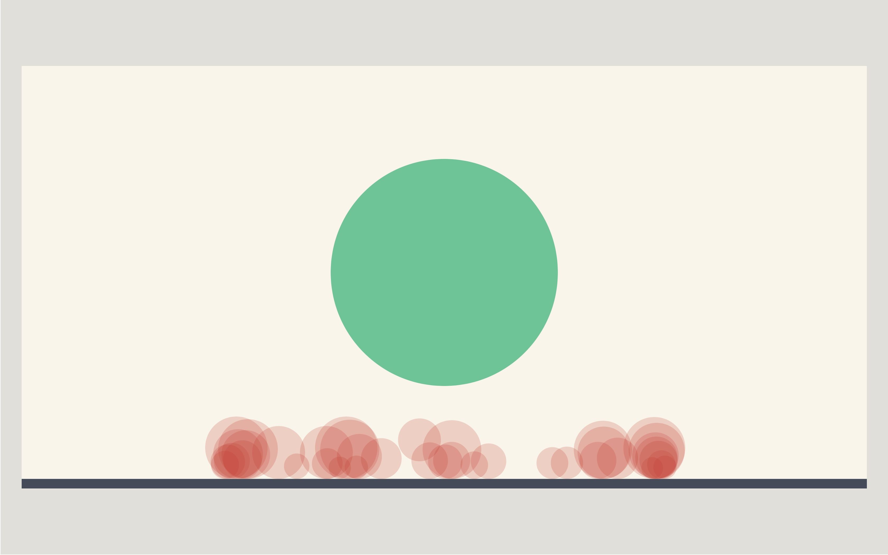

# Five second chances

This clock is inspired by Mel Robbins’ five second rule that she describes as her tool to bridge the knowledge-action gap. For some time I was very interested in the phenomenon of motivational talks. Even though they often seem trashy in a lot of ways, it is a format that was quite popular in the 90s and regained popular interest in the last years. Her five second rule is derived from the idea, that the human brain is hard wired to avoid an discomfort and one efficient way to trick the mechanism of talking oneself out of an idea is to start before making up reasons why not to do it. Her recommendation is to count down from five and then just take an action regarding the idea one just had. Even though this is just a very narrowed down concept she suggests that it is derived from and a form of meta-cognition.

**Reference:**
[Link to one of her youtube-talks](https://www.youtube.com/watch?v=nI2VQ-ZsNr0)

My clock attempts to visualize this concept with a green circle that shrinks within five seconds while the fill increases in opacity and at the end of a circle releases a red circle as a symbol for a missed chance. Originally I wanted the circles to pile up, filling the negative space throughout the day. Additionally I wanted to allow the user to click on red circles, to switch the fill to green to symbolically speaking highlight chances the user had the feeling he acted upon.

I didn’t get there programmatically yet, so I implemented a rectangle rising the ground level throughout the day.

## Screenshot

_2018-09-26 at 00.32.35_

## Reading the clock

1. The green circle signifies the state of a five second phase.
2. The red circles indicate how many five second chances have passed since the clock was opened.
3. The dark grey area over the light background indicates the passage of the day.

## How to continue

- [Proper collision detection](https://processing.org/examples/circlecollision.html)
