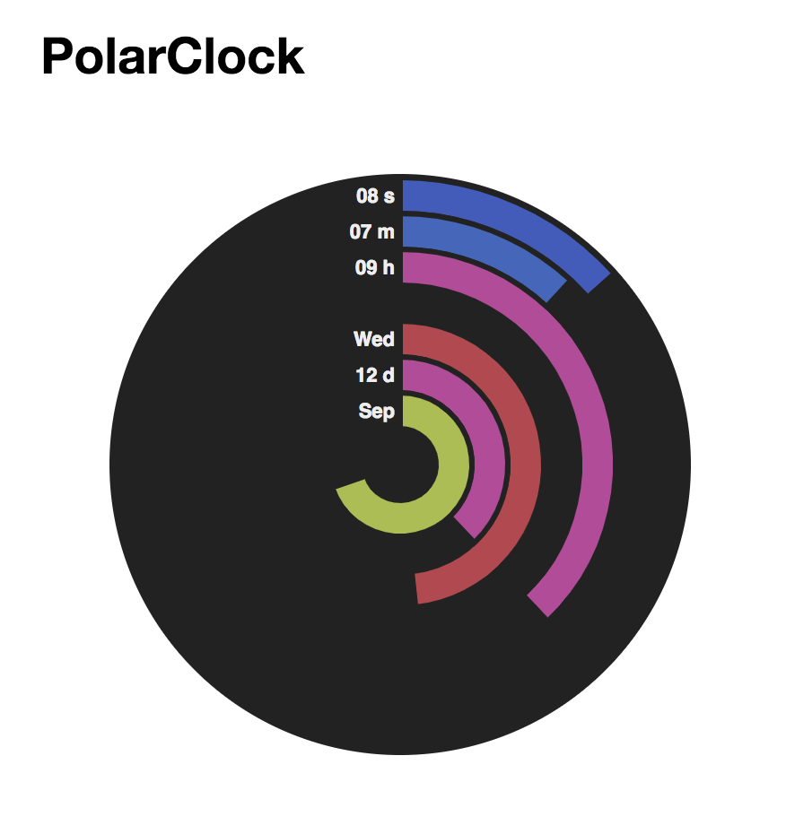
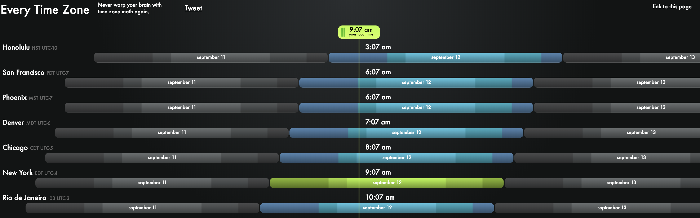

### What’s In My Sketch Files

There are two types of sketch files presented. There is a handwritten prototype, in which I simply sketched my general idea with pen and paper. In the other file, there is a prototype made in Keynote, in which I was able to get more specific about how I wanted the output to appear. There are a couple changes between the handwritten and Keynote sketches because I started to refine the visualization in the latter.

### Logic of the Representation

When brainstorming how I would want my clock visualization to look and operate, I first thought about my audience. In this case, I wasn’t necessarily aiming for someone to be able to quickly glance at the visualization and understand the time. I didn’t want it to be used for only that utility. I wanted to experiment with more design and create a result that can used for telling the time, but is also interesting to look at. I started by researching other clock visualizations to get a feel for what has already been done. I came across the PolarClock and every time zone visualizations shown below.

Using what I already decided on in terms of my audience, I tried to merge these two visualizations. The result kind of looks like a game of Connect Four, but the intent is to overload a bit more on the design rather than the practicality.

### Bertin-ian Retinal Variables

The retinal variables I wanted to focus on are shape and value. With shape, I used the same visual components (circles and bars) to group together the different aspects of time (in this case, hours, minutes, months, and days). With value, I added a heat map shading to each visual component in an attempt to encode how late it is in the day and hour. I inverted those colors for the date bars to ignite some separation between the two sets of bars.

### Things to Think About As I Finish My Visualization

As I begin to create and refine the visualization, something I definitely need to work on is differentiating more between the two sets of bars (the left is hour/minute and the right is month/day). Right now, I’m relying on intuition of how English-language speakers usually read the time and date.
