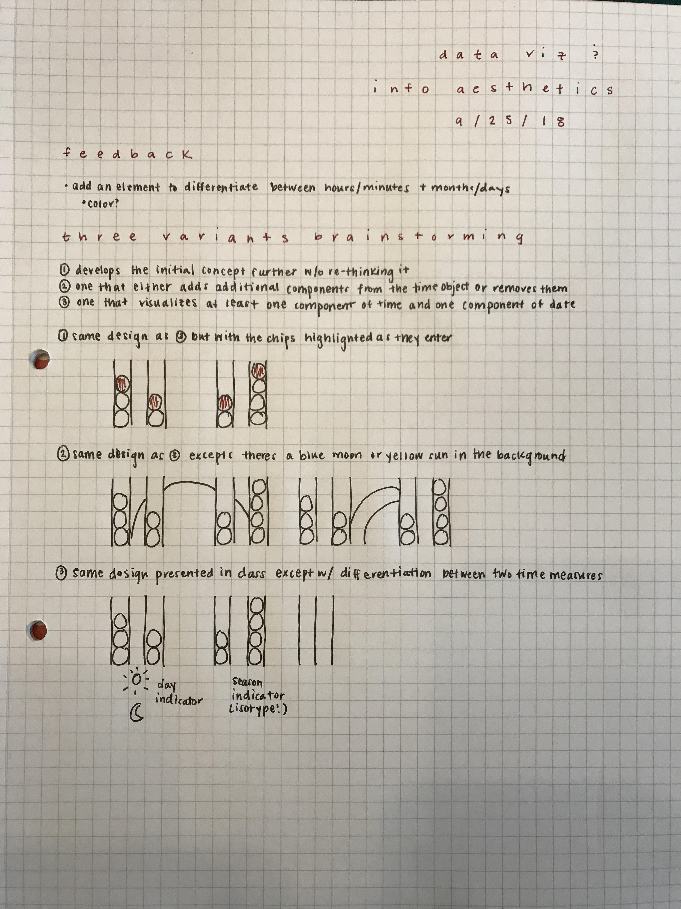

## Second presentation:

### How I incorporated class feedback

The main point of feedback I received from the class was around differentiating between the hours/minutes part of the visual clock (to the left) and the months/days part of the visual clock (to the right). To do so, I got interested in incorporating seasons, which I will explain more below.

### Three designs explained

#### Medium

The medium design incorporates this class feedback with the original, Connect Four-style design that I presented. Aesthetically, I wanted to keep the overall design simple and minimalistic. But, as I said, I got interested in incorporating the idea of seasons, which I did on the month bar. The winter months are dark blue, the spring months are green, the summer months are tan/yellow, and the fall months are a deep red. The color choices were inspired by the actual seasons themselves, an additional of visual encoding and a nod to Bertin-ian Retinal Variables.

#### Small

The feature I decided to remove was the hours and minutes aspect of the visualization, so it becomes a calendar of sorts, still with the season color encoded.

#### Large

I decided to expand the seasonal color idea to the background of the piece, which also changes in accordance to the listed colors above, expect the hues are slightly different. Design-wise, I thought it was a nice complement, but it also made seasonality a primary aspect of the piece. Because of this, I called my end result a seasonal visual clock.

### Brainstorming

After our class with feedback, I went back to my sketch paper and thought through some new directions. I didn't want to make the piece too complicated and hone in on the simplicity, but I wanted to try out these seasonality filters.

### Wish list

There are three features I would add later if I had more time: 1) The background would change according to time of day (before noon is a light color and after noon is a dark color), 2) The chips would fall into the screen like an actual game of Connect Four when a new hour/minute/month/day happens, and 3) I would highlight the new chip.

## First presentation:

### What’s In My Sketch Files

There are two types of sketch files presented. There is a handwritten prototype, in which I simply sketched my general idea with pen and paper. In the other file, there is a prototype made in Keynote, in which I was able to get more specific about how I wanted the output to appear. There are a couple changes between the handwritten and Keynote sketches because I started to refine the visualization in the latter.

### Logic of the Representation

When brainstorming how I would want my clock visualization to look and operate, I first thought about my audience. In this case, I wasn’t necessarily aiming for someone to be able to quickly glance at the visualization and understand the time. I didn’t want it to be used for only that utility. I wanted to experiment with more design and create a result that can used for telling the time, but is also interesting to look at. I started by researching other clock visualizations to get a feel for what has already been done. I came across the PolarClock and every time zone visualizations shown below.

Using what I already decided on in terms of my audience, I tried to merge these two visualizations. The result kind of looks like a game of Connect Four, but the intent is to overload a bit more on the design rather than the practicality.

### Bertin-ian Retinal Variables

The retinal variables I wanted to focus on are shape and value. With shape, I used the same visual components (circles and bars) to group together the different aspects of time (in this case, hours, minutes, months, and days). With value, I added a heat map shading to each visual component in an attempt to encode how late it is in the day and hour. I inverted those colors for the date bars to ignite some separation between the two sets of bars.

### Things to Think About As I Finish My Visualization

As I begin to create and refine the visualization, something I definitely need to work on is differentiating more between the two sets of bars (the left is hour/minute and the right is month/day). Right now, I’m relying on intuition of how English-language speakers usually read the time and date.
