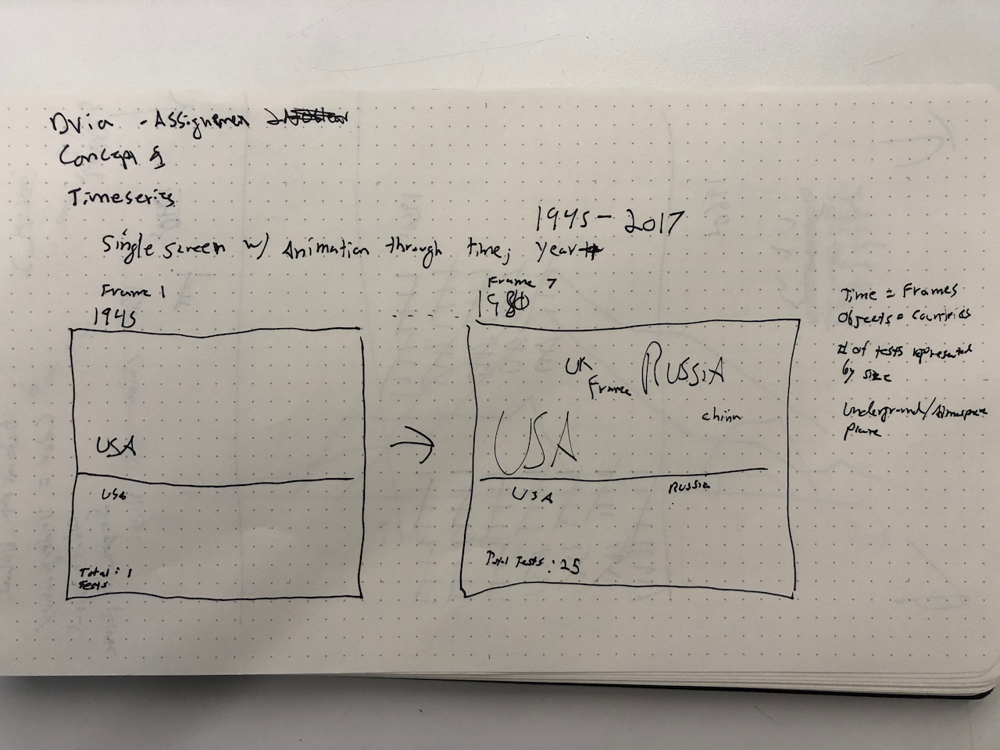
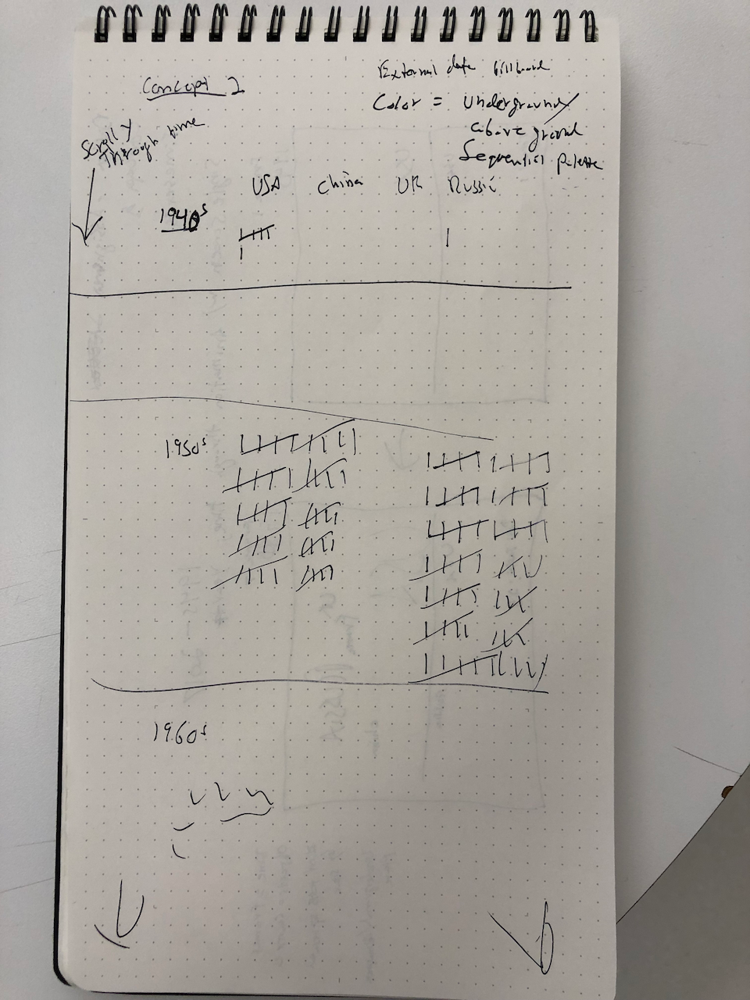
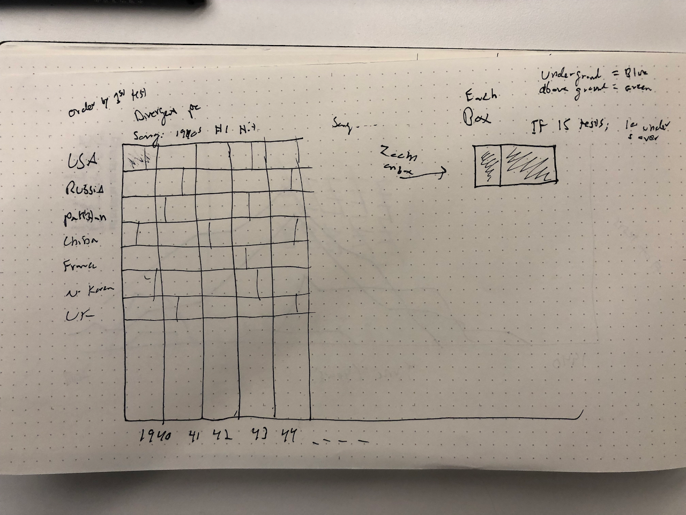

## Process

Description of the contents of this folder, a prose description of your ideas for how to represent
the nuclear testing time series, and links to external data sources you'll be incorporating into
the project.

#### Concept 1

- Concept 1 expresses time as a series of single frames. Every second a new year takes over the entire canvas.
- The objects are the text of the country, positioned roughly where they appear on a world map.
- The size of the text indicates the number of tests that year
- Above/underground: Either above or below line (see drawing) or divergent palette whoch colors the text.
- External data set: play top billboard song during each decade (10 seconds)

#### Concept 2

- Concept 2 uses tally marks for the number of tests per decade
- Vertial scrolly, time on the y axis
- Colors of tally marks will be either blue or red indicating an underground or above ground text

#### Concept 2

- Heat map style plot
- Time on x axis
- Each country box is split between above and below ground test.

#### Secondary data set

Billboard top songs of each decade

[Billboard wiki](https://en.wikipedia.org/wiki/List_of_Billboard_Hot_100_chart_achievements_by_decade)
