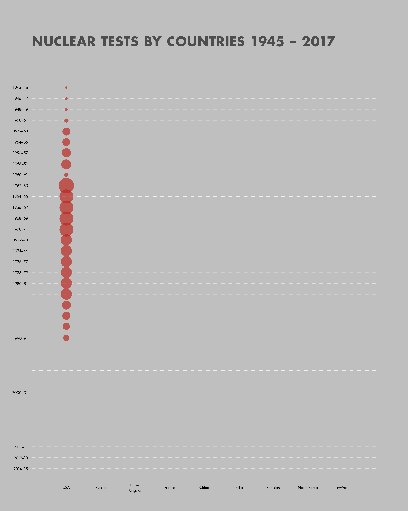
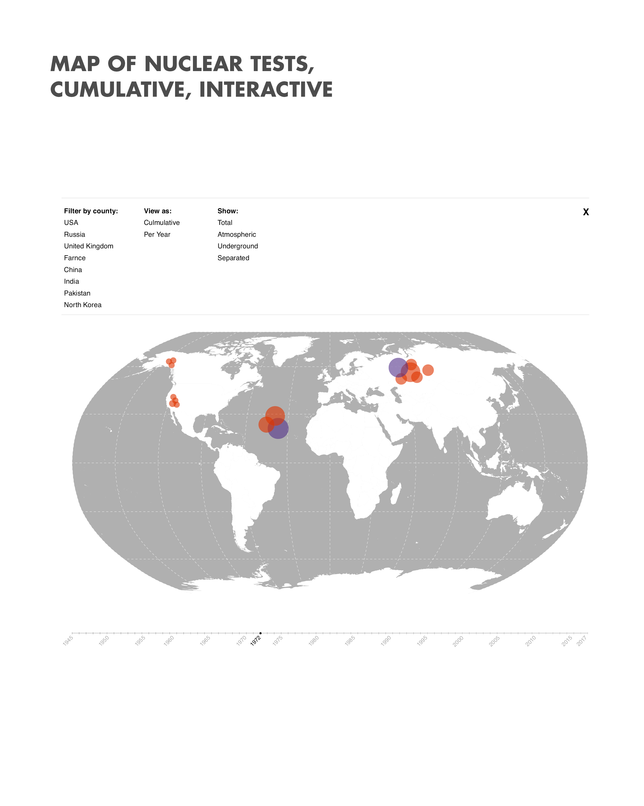
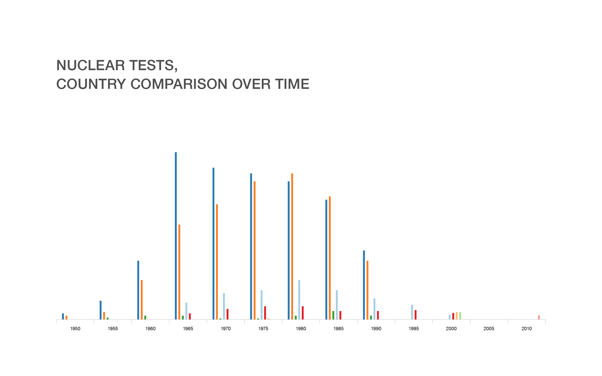
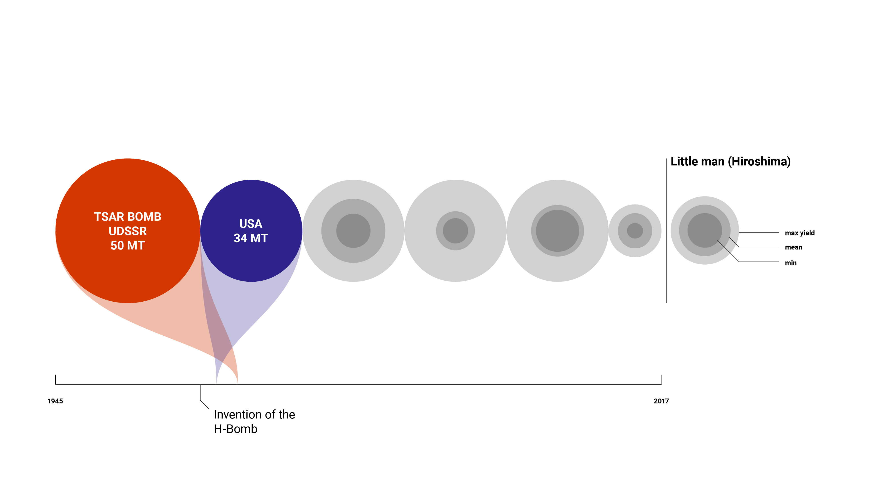
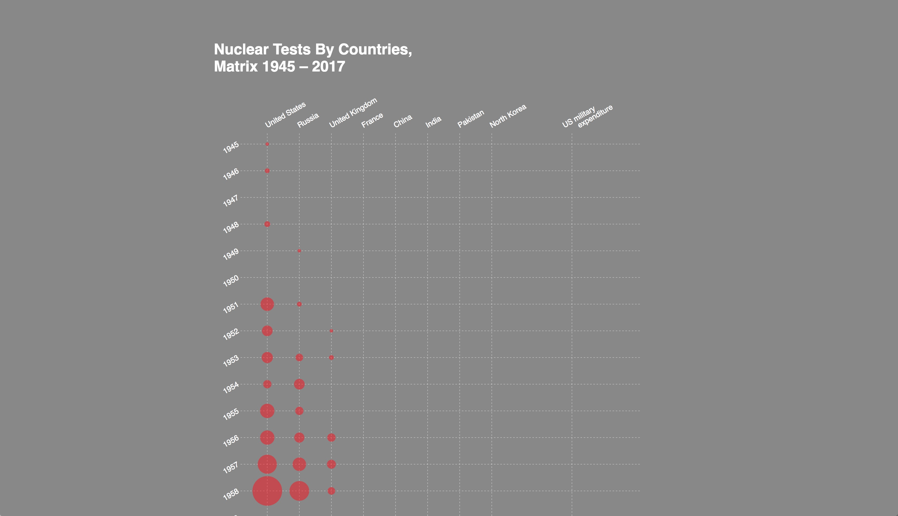
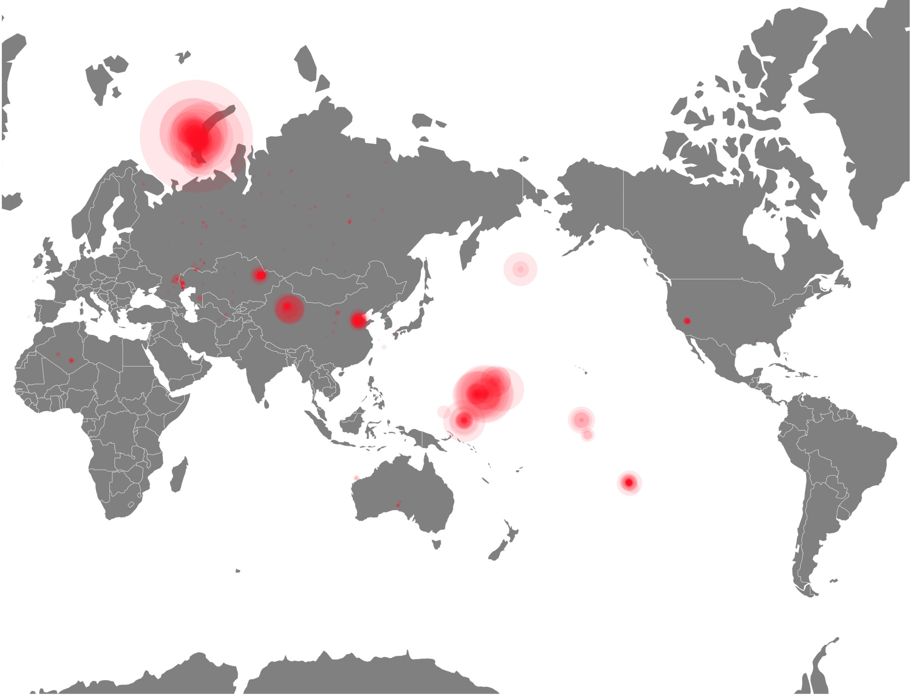
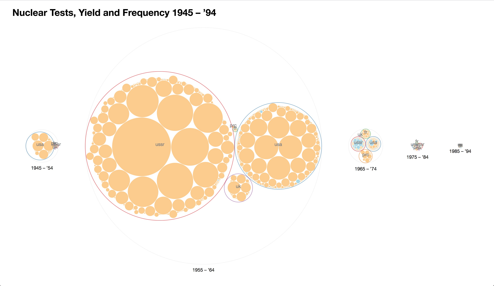
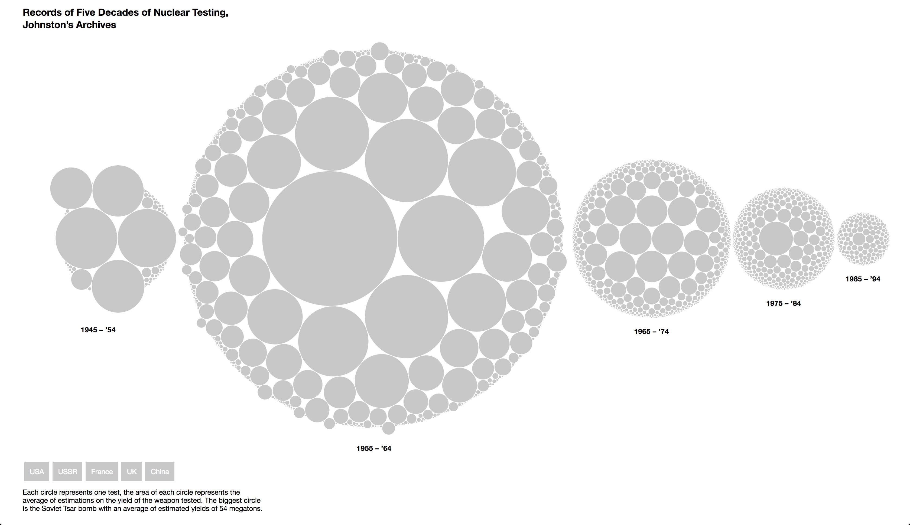
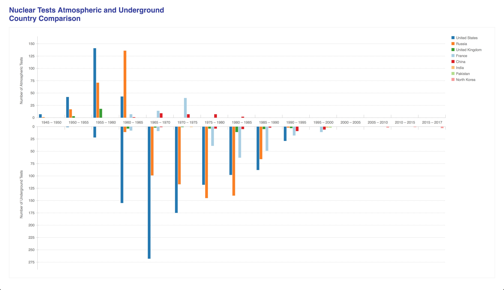

Felix Buchholz
Data Visualization & Information Aesthetics, Christian Swinehart

# Project: Mapping Quantities

## Process

### Ideas for External Variables:

1. Military Spending - worldbank
2. Cancer incident rate – https://hsus-cambridge-org.libproxy.newschool.edu/HSUSWeb/table/showtablepdf.do?id=Bd490-512
- Located near testing sites
3. Stock price of Lockheed Martin, Boeing, Honeywell Int.
4. Consumption of mushrooms in Russia
5. Number of teddy bear sales – https://hsus-cambridge-org.libproxy.newschool.edu/HSUSWeb/table/jumpto.do?id=Dd498-560
6. Number of nuclear weapons / Nuclear arsenal U.S. - https://hsus-cambridge-org.libproxy.newschool.edu/HSUSWeb/toc/tableToc.do?id=Ed223-227 (strategic nuclear weapons: 1945–1996), Budget for nuclear weapons
7. Technology advance – https://hsus-cambridge-org.libproxy.newschool.edu/HSUSWeb/table/downloadtable.do?id=Cg258-264 (Performance indicators of computers and transistors: 1946–2000)
8. Historical Facts – https://hsus-cambridge-org.libproxy.newschool.edu/HSUSWeb/toc/tableToc.do?id=Ed228 (U.S. arms control and weapons treaties and agreements: 1922–1996)

##### Idea

An inverse timeline of nuclear test. Inspiration: [Atomic bomb in reverse](https://www.youtube.com/watch?v=VfmUwEarzkA
)

#### Class discussion and ideas

>
- Brad: Lat/long, yield
- Zui: International conflicts (Source: US Davis). Number of conflicts, casualties
- Andrew: Most popular song of each year
- Candice: Number of bombs that have been lost
- Feedback for my project: Civil defense groups, bunkers.
    - Fallout shelters
    - Energy & money that was spent on surviving
    - Not stock prices, but network of contractors
    - Freight trains
    - economic network

##### Stories:
>
1. Mapping + Timeline (Atmospheric, underground, country)
2. Reversing the nuclear bomb: treaties and policies
3. Defense systems (Expenditure, Location)
4. Accidents (Location/map)
5. One test and the data / functions of it
6. Bombs that went missing
7. Just looking at one bomb – Tsar

##### Feedback:
>
1. Timeline of tests/yields grouped in decades (individual tests, vs yields)
2. Insecurities in telling a story about nuclear testing
    1. Min/Max yield, no yield, yield

### Drafts:

My first draft is about visualizing the number of nuclear tests by country on a timeline. The area of each circle representing the number of tests:

The second idea is to try and combine a geospatial mapping of tests with a historic timeline, that can be filtered by country and atmospheric and underground tests. The timeline itself would function as a filter as well, a year could be selected and the tests of that year or the cumulative amount of tests up to that year could be shown.

The third approach was a very simple, maybe dry approach to compare the amount of tests by country for every five years on a timeline.

Another way of making a country comparison would be to compare their biggest bombs and locate them on a timeline. This would also include visualizing the uncertainty how strong the yield of every test was, since the yield was also an important feature of these tests in the cold war.

### Level of implementation

I implemented the vertical timeline approach, and used US military expenditure as a external variable, unfortunately the data I have right now is not dating as far back as the test data and there’s no inflation correction. When revisiting this I also need to include a legend for the number of tests and use another visual paradigm for the military expenditure than for the number of tests.

I’m showing tests represented by circles on a map with the area matching the yield of the tests. Opacity is reduced by a constant value to show overlapping tests.

I started to experiment with d3’s circle packing method and my first attempt was to compare atmospheric and underground test and tests by the yield. The packing on two hierarchy levels is not as successful as I thought, and the comparison of atmospheric and underground is not very revealing

It was better to only use one level of hierarchy, color coding the countries and enable toggling countries on and of. I think this approach is most promising, but I need to include a legend as well and I’d love to use more than this approach to combine in a big more informative narrative. Overall I like how it enables a comparison of countries as well as an historic comparison and to see that the Tsar Bomb was nearly as explosive as all tests between ’75 and ’84 was the most revealing across my approaches. 

The simple bar chart is the most complete, maybe also the most boring, but I like it for it’s clean and simple overview.

### Learning experience

I think for these projects I started to early trying to implement approaches and I had a hard time finding and combining data from different sources. I would love to combine different of these approaches and have panels that also are interacting with each other.
