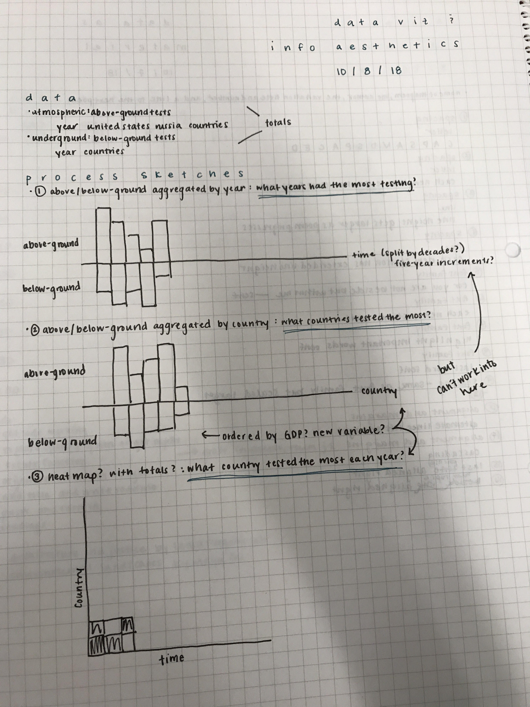
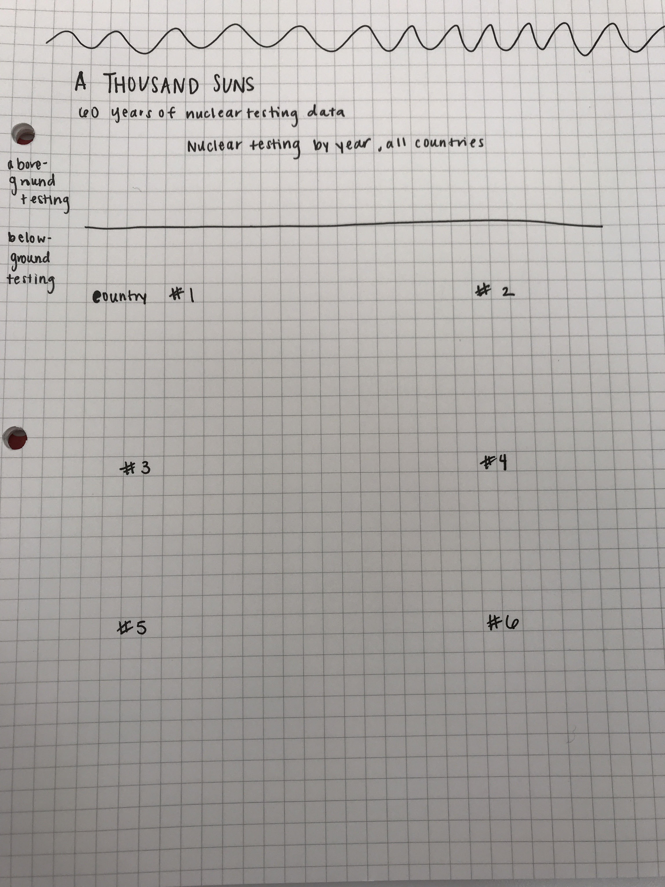
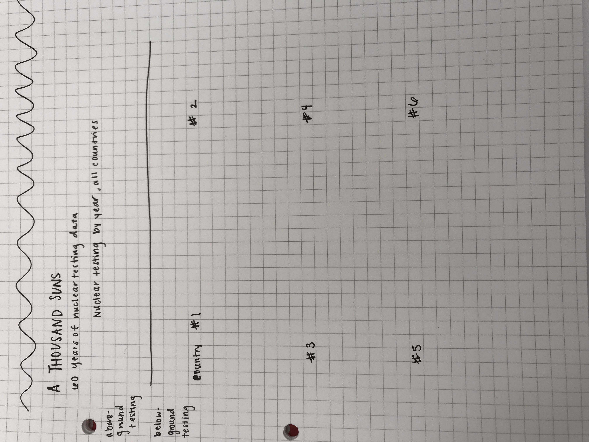

# A Thousand Suns
## Caitlyn

### Handwritten Process #1

The first concept I sketched played around visually with the idea of above-ground testing versus below-ground testing. There is a bar chart as you would imagine it for above-ground testing counts by year. Below it mirrored is the below-ground counts by year. 

The second concept I sketched duplicatded this idea but instead grouped by country, ordered by my external variable current GDP by country.

The third concept broke from this idea and instead created a heat map with the data. Country is on the y-axis, ordered by current GDP, and time on teh x-axis. The matrix is colored by the number of tests for that country each year. 

While this visualization I felt had the most information displayed, I think it experimented with the actual data less. In other words, the inverted bar chart works particularly well for this situation specifically while the heat map can work for plenty of situations.

### Handwritten Process #2

During class, I revisted these ideas and decided to focus on the first with the timeline of counts aggregated by year. One the sketch, I added notes and stream of consciousness ideas for how I could augment the design, including annotations, interactivity, etc.

After receiving feedback, I decided to expand on the first concept by adding small multiples broken down by country below. This restores some of the information lost when the data was aggregated by year.

The sacrifice that came with this concept was a sound way to integrate my originally-planned third variable: GDP. I decided to completely change this third variable to better match the story in the visualization. Instead, I integrated which years each country was in war, which is colored by each bar.

I feel this tells a more complete story of nuclear testing's place in history through a timeline-like bar chart.

### To-do

- Scale bottom graphs
- Add axes and color legend
- Style
- Clean up code (variable names)