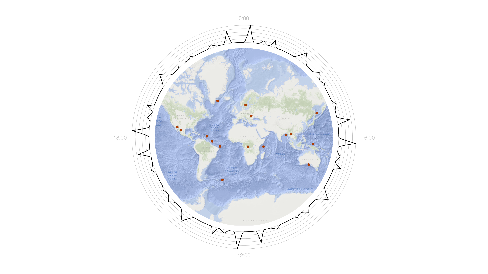

Felix Buchholz  
Data Visualization & Information Aesthetics, Christian Swinehart

# Project: Mapping Space

## Process

For this exercise I started with getting more familiar with the data and I tried to spent more time just understanding each column of the table and just thinking about which of them are essential to the mapping, which are interesting and what kind of encoding I would use.

### Getting familiar with the data

[Key to the columns](https://earthquake.usgs.gov/data/comcat/data-eventterms.php#net)

These columns are essential:

| Key               | Explanation                             | Encoding       |
| ----------------- | --------------------------------------- | -------------- |
| lat and longitude | position                                | position       |
| mag               | off. best est. for size event           | size or color  |
| depth             | very inconsistent way of measurement /1 | shape or color |
| time /2           | format: 1970-01-01T00:00:00.000Z        | tooltip        |

**/1:**

> Since ComCat includes data from many different seismic networks, the process for determining the depth is different for different events. The depth is the least-constrained parameter in the earthquake location, and the error bars are generally larger than the variation due to different depth determination methods.

I would probably need to research the different ways to measure to properly account for the depth. [Comcat link to depth](https://earthquake.usgs.gov/data/comcat/data-eventterms.php#depth)

**/2:**

> Time when the event occurred. Times are reported in milliseconds since the epoch ( 1970-01-01T00:00:00.000Z), and do not include leap seconds. In certain output formats, the date is formatted for readability. Note that large earthquakes can continue rupturing for many 10's of seconds. We provide time in UTC (Coordinated Universal Time). Seismologists use UTC to avoid confusion caused by local time zones and daylight savings time.

It would probably nice to translate that to the local time

These columns seem interesting to use to me:

| Key             | Explanation                           | Encoding           |
| --------------- | ------------------------------------- | ------------------ |
| nst             | # stations used to determine location | ?                  |
| place           | textual description of the location   | tooltip            |
| type            | “eq”, “quarry”, “explosion”           | shape, color, icon |
| magError        | est standard error of the magnitude   | grey shape         |
| horizontalError | horizontal location error /3          | grey polygon       |
| depthError      | depth error, in km                    | grey polygon       |

**/3:**

> The horizontal location error, in km, defined as the length of the largest projection of the three principal errors on a horizontal plane. The principal errors are the major axes of the error ellipsoid, and are mutually perpendicular. The horizontal and vertical uncertainties in an event's location varies from about 100 m horizontally and 300 meters vertically for the best located events, those in the middle of densely spaced seismograph networks, to 10s of kilometers for global events in many parts of the world. We report an "unknown" value if the contributing seismic network does not supply uncertainty estimates.

Just for reference:

| Key     | Explanation                                       | Encoding |
| ------- | ------------------------------------------------- | -------- |
| net     | Network delivering the data                       | none     |
| gap     | gap between azimuthally adjacent stations         | none     |
| dmin    | h distance: epicenter to the nearest station in ° | none     |
| updated | Time  event was most recently updated             | none     |

**not included: DYFI infomation =**
[Reference for est fatalities and economic losses](https://earthquake.usgs.gov/earthquakes/eventpage/ak20292186/pager)

### First Drafts

#### Hand-drawn

I started with scribbles of visual association:

#### Layouts

I then proceeded to make layouts in InDesign and I first tried to find out how I wanted to **space out** the elements:

Because I like print designs I then explored, what I would do for example for a **magazine layout**:

And tested if it could be interactive as well:

But I found that this doesn’t feel engaging to interact with. I shifted focus to explore a focus on a 24 hour time frame:

I wasn’t really happy with the seismograph idea because a seismograph wouldn’t look like a line plot and at the same time the waveform of a seismograph probably wouldn’t be easy to read, but I think there’s still potential to explore this.

I shifted to bars to visualize magnitude instead:

I like this idea and tried it on a dark background as well:

Somehow the map reminded me of what a vision of a earthquake control center might have looked like in the sixties (maybe also another decade, I’m bad at identifying historical design epochs). I wanted to create a complete interface in that style:

### 20181031 Class Discussion and Feedback

#### Class Discussion:

>
- External data, allowed but not required
- Think about categories: What does a average day look like?
- Tectonic plates movement, find the closest fault line and measure the distance to it
- Ways to think about the map differently:
  - Subway maps – rational paradigm over geographical paradigm
  - Ocean – Earth

#### Class Ideas

>
- AM and PM juxtaposition
- Depth of earthquakes below
- Relation between depth and magnitude
- Magnitude in qualitative color scheme
- Animation: shaking
- Elevation of the map (like a heatmap) is the mapped data

### Draft updates, overall conceptual approach

After class I refined the two ideas a bit and found my overall conceptual approach.

1. I want to start with the earthquake supervision center interface and an introduction on the three categories for seismic events: “Natural”, “human-made” and [“human-induced”](https://en.wikipedia.org/wiki/Induced_seismicity).

2. The second view would be the time focus: A small multiple of 9 days of a month with significant human-made seismic events to try and detect patterns, where and when they happen. This also introduces the necessity to translate the time stamps from the dataset to local times.

3. I would end with a small summary of current findings about induced seismicity and visualize a this [timeline](https://en.wikipedia.org/wiki/Induced_seismicity#List_of_induced_seismic_events). But unfortunately I didn’t find the time to draft this.

## Level of implementation

At this point I only managed to implement the first view. The version of the histogram beneath the map was my main focus and can be filtered with the slider to its right. Unfortunately the interactivity for clicking on each circle on the map is not yet as refined as I would want it to be: Additional information on each event is displayed on by clicking on one of the circles, but currently the visual feedback which circle is selected should by graying out all other circles, also on the histogram instead of the small arrow. And the small visual icon that would map depth and the margin of estimated location error is not yet implemented.

For the current implementation I changed the color scheme which is a bit of a departure from the retro association, but makes the three categories more distinct and the human-made events easier identifiable.
