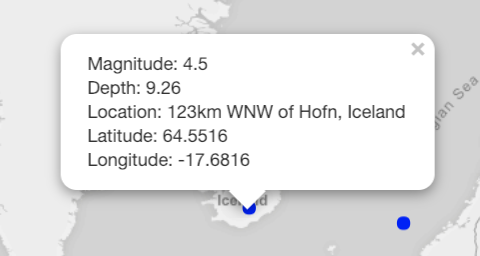

# Data Vis & Info Aesthetics - Assignment 3

## Overview - Earthquake data

For assignment 3, Stones Unturned, the primary focus was to chart the earthquake locations on a map.  I decided to focus on a global view of the map, and to supplement the visual representation of the map with some dynamic natural language that included key fields from the data set along with a visual for the overall threat level.

#### Panel 1 - Decade Segmented Time Series
In the first panel presented below I implemented a global map, using Leaflet.js. I found using this relatively easy and had also used it for the Data Structures course. I used the map.light tile as it was my preferred one and was easier to visually transition into the second panel.  

Panel 1 is displayed below:

For every earthquake that has occurred there is a variety of data and I wanted to use the popup for each respective location to display that more detailed information.  I formatted the popup to have five fields with each of them displayed on a line respectively.  Overall I was quite happy with how the popup turned out, an example is displayed below:

#### Panel 2 - Dynamic natural language
After reexamining all of the other work that I had completed, I wanted to focus on producing a visualization that was completely different to the other assignments.  While the map portion satisfied this, I also wanted to included a style of visualization that I hadn't used before and chose to implement some dynamic natural language.

Initially, I implemented this in a standard manner with the same font.  However, after reviewing this, I reformatted the dynamic portion of the text in a different color and size to ensure that it is emphasized.  I also used a similar treatment with the "threat level" visualization.

The implementation of the dynamic natural text is shown below:

#### Bringing It Together
After combining panels 1 and 2 together, the final visualization came out as shown below:

## Final thoughts
When looking at the final output in isolation it is apparent that only a minimal level of the data is displayed at first glance however, because of the interactivity of the map the user is able to drill down into any earthquake of interest and view the details with the popup.  Overall, I feel like this lighter on the data approach brought balance to the rest of my portfolio which is generally on the heavier side of data visualizations.
