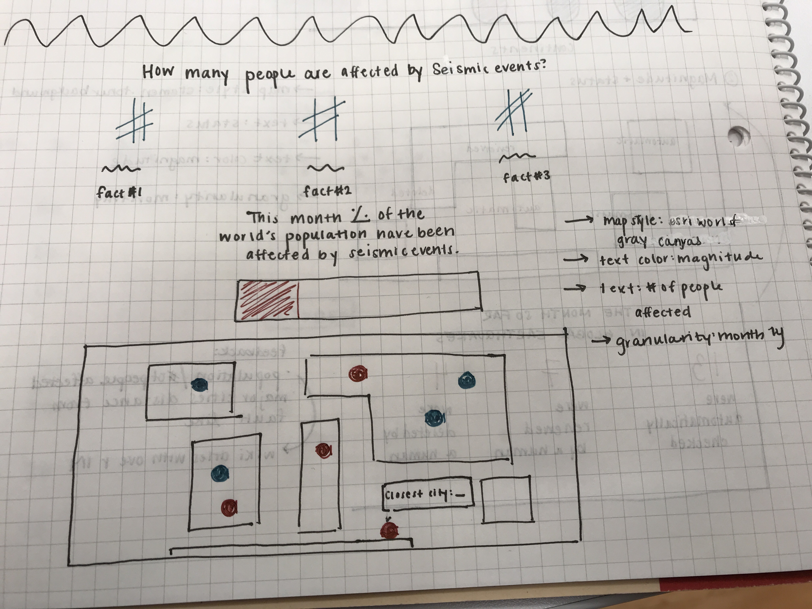
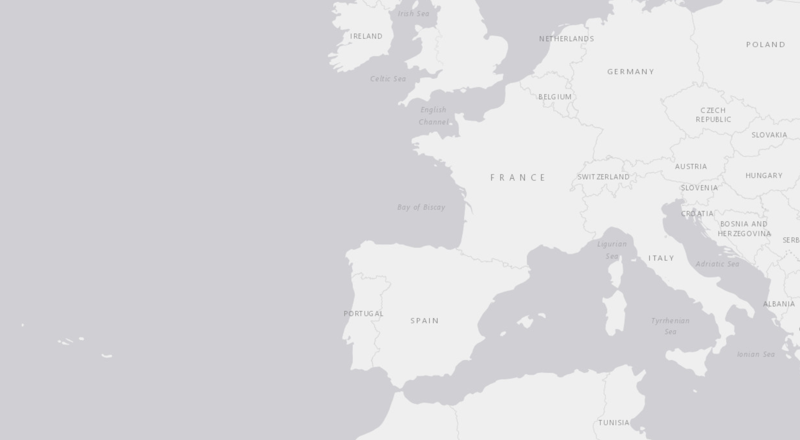
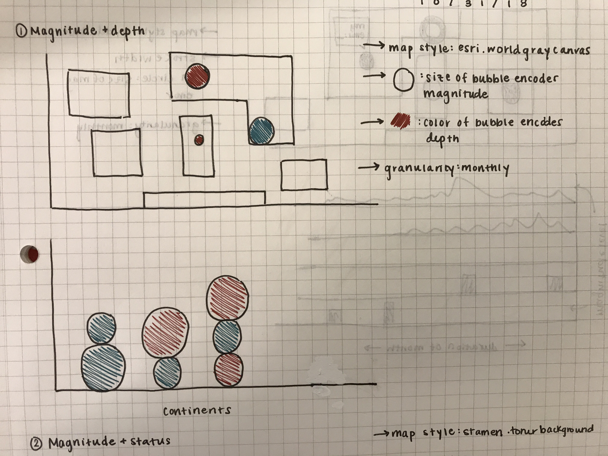
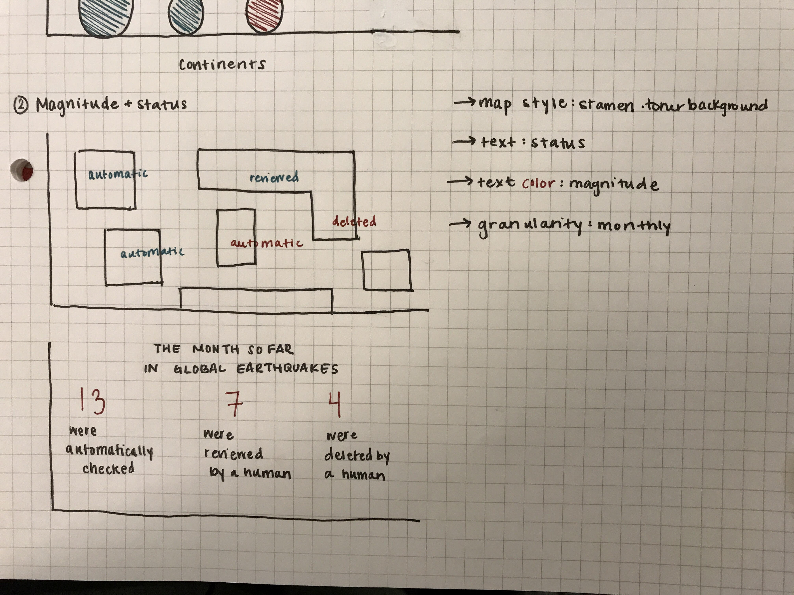
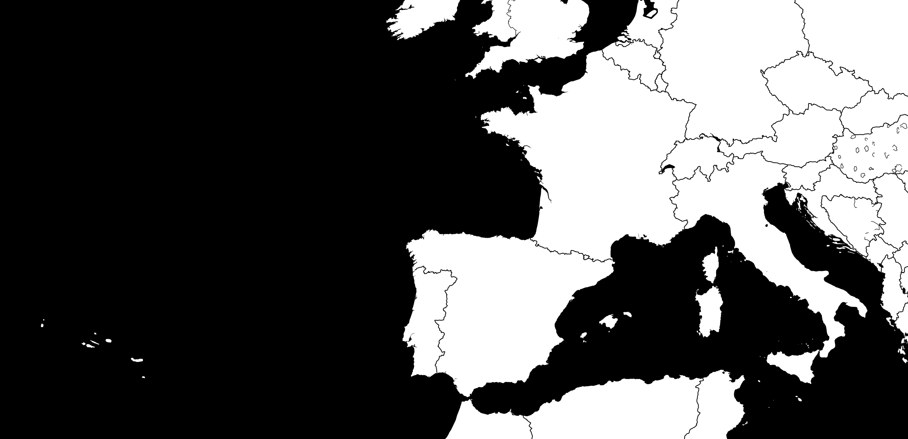
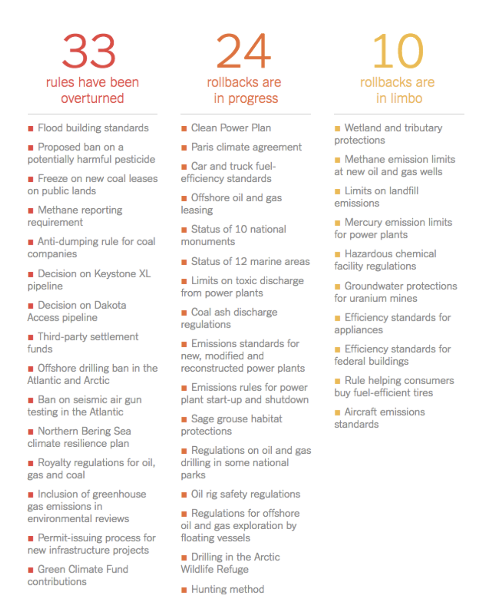
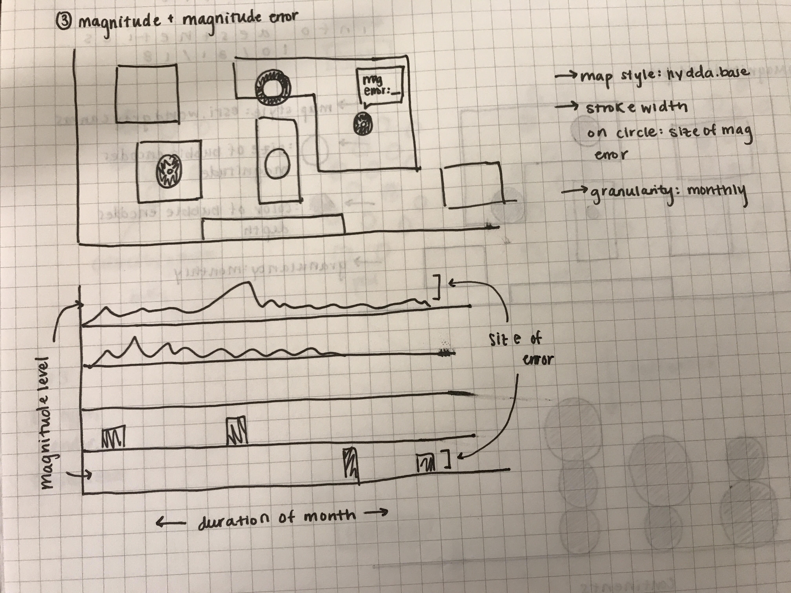
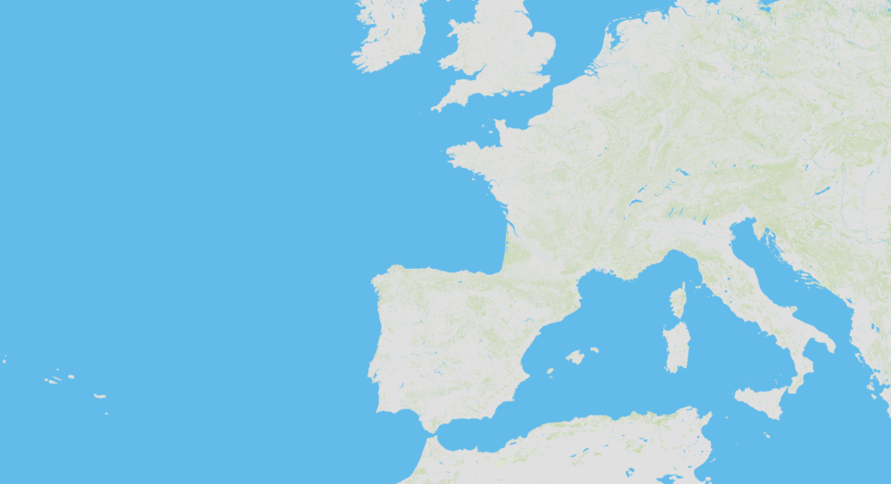

## Process

Description of the contents of this folder and a prose description of your ideas for how to represent
the earthquake data geospatially and diagrammatically.

## Handwritten Sketches

### Concept 4: Magnitude and Population

#### Diagram
The diagram portion of this concept will introduce the map with a series of important numbers of the amount of people affected by seismic events that month. There will be a bar to show what percentage of the New York City population was affected by seismic activity this month. This bar section will interact with the map portion. When a user scrolls over a point on the map below, the bar will highlight which percentage is attributed to that selected event.

#### Map
The map portion of this concept will utilize dot markers to represent locations where earthquakes have been recorded. The color of the bubble encodes *magnitude*. I'll use a color brewer scale for color. A tooltip will indicate the closest population center.
The granularity will be at a monthly level, and the map style I'm planning to use is grayscale since color will be an integral part of the design, which I don't want to distract from at all.

### Concept 1: Magnitude and Depth

#### Map
The map portion of this concept will utilize circle markers to represent locations where earthquakes have been recorded. The size of the bubble encodes *magnitude*, and the color of the bubble encodes *depth*. I'll use a color brewer scale for color.
The granularity will be at a monthly level, and the map style I'm planning to use is grayscale since color will be an integral part of the design, which I don't want to distract from at all.

#### Diagram
The diagram portion of this concept will translate what the map represents. I'll do some preprocessing to aggregate the reports by continent. The circles, with the same encoding, will translate to the diagram to form a bar chart of sorts. This will also show which continents had the most reports that month.

### Concept 2: Magnitude and Status

#### Map
The map portion of this concept will utilize text markers to represent the status of the earthquake in the locations they were recorded. The text encodes *status*, and the color of the text encodes *magnitude*. I'll again use a color brewer scale for color.
The granularity will be at a monthly level, and the map style I'm planning to use is black and white, again, since color will be an integral part of the design. I want the background to be the least distracting.

#### Diagram
The diagram portion of this concept will  play with typography to more clearly represent the raw numbers from the map. I'll do some preprocessing to aggregate the reports by status. Focusing on typography and design, and also pulling from the text design in the map, I'll represent the number of reports that fell under each status.

Inspiration:

### Concept 3: Magnitude and Magnitude Error

#### Map
The map portion of this concept will utilize circle markers to represent the magnitude and magnitude error of the earthquake in the locations they were recorded. The stroke width of the bubble encodes *magnitude error*, and a tooltip attached to each bubble encodes the *magnitude*.
The granularity will be at a monthly level, and the map style I'm planning to use integrates basic map color since color is not an integral part of this design.

#### Diagram
The diagram portion of this concept will add time as a third variable to experiment with the connection between magnitude and magnitude error over the course of the month. The visualization will be a timeline on the horizontal axis with magnitude encoded on the vertical access, which peaks that encode the magnitude error of the earthquake recorded at that time. This will either take the form of small bars or a ridge/joy plot.

