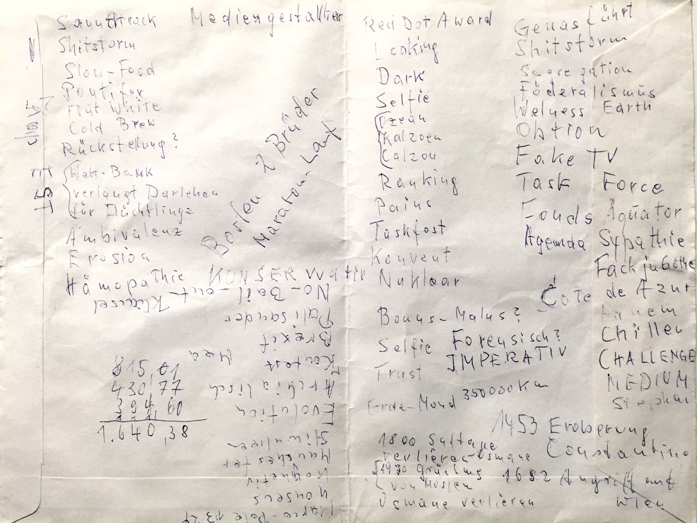

# Initial ideas

1. Left-wing punk rock in Germany. A subculture as a measure to mainstream political movements between 1976 and 2006. (Amount of concerts, published records, active bands, significant events)

2. The rise of post-structuralism in the 70s/80s. Analysis in numbers (publications, citations, professorships, google n-grams).

3. Making sense of lists posthumously. Continuation of my MFA diploma thesis [http://felixbuchholz.com/](http://felixbuchholz.com/). My grandma had been writing lists in the last years of her life. Rarely these are just groceries lists, often they look like auto-didactic study, circling around politics, history and health, I would like to work with these lists, digitalize them and try an analysis of word counts, word proximities and similar approaches.

4. Material inequalities. Comparison of 1917 and 2018.

5. Heritage and equal opportunities, international comparison.

6. German weapon exports (and casualties).

7. Suicide rates after famous suicides.

8. The use of the word porn in social media for posts unrelated to pornography.

9. The history of inspirational talks for business motivation.

10. The architectural history of church windows and contemporary artworks using church windows as a medium.

# First Feedback

1. Compare UK and USA
2. Focus on a certain amount of specific authors and articles.
3. Dive into the dataset
