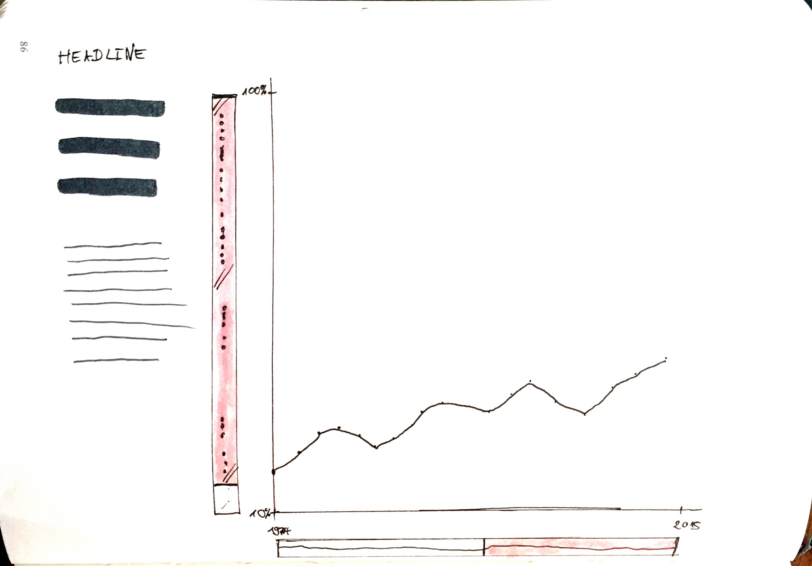

Felix Buchholz
Data Visualization & Information Aesthetics, Christian Swinehart

## Final Project: Free Form

_Note: I’m sorry, I’m writing so much about this topic. I think, I’m still trying to find the right language to communicate my thoughts on this subject and it’s challenging for me since I’m very new to the field as well as English not being my native language I find it often hard to find the right tone and way to address subtleties._

# How to measure inequality

Doing more research on inequalities, I realized that there are plenty of different dimensions and aspects to inequality than just income distribution and 90:10 percentile ratios.

The Stanford Center on Poverty & Inequality for example lists the following research groups.

- Consumption
- Discrimination & Poverty
- Education
- Family
- Health
- Housing
- Incarceration
- Income and Wealth
- Labor Markets
- Life Course
- Poverty
- Race, Ethnicity, and Immigration
- Safety Net
- Segregation
- Social Mobility

Some of those definitely overlap and I would try and think of more general categories and subcategories.   But inspired by the reading of Chapter two of Drucker’s Graphesis, I want to adjust the focus of my final project.

Instead of re-visualizing Piketty’s dataset for Capital in the 21st century I want to find ways to visualize the influence of various design and measurement choices on the result and how equal or unequal a observed situation / community / society appears. I would think that these choices are heavily guided by theoretical considerations about justice and political beliefs and intentions. I think this visualization could be successful if it provided some orientation and literacy to navigate this highly contested domain.

To achieve this goal I’m currently thinking of three different approaches:

1. Visualizing the decision & design process
2. Visualizing different outcomes in a small multiple approach, where one measurement or design choice is changed on every iteration.
3. Visualizing just the difference of the outcomes. Which is very attractive in theory, but currently I struggle to come up with a good visualization approach.

Currently I’m most interested in approach 1 and I can think of two sub sets of how to visualize the decision process. For both I want to use somehow famous or effective visualizations and analyze them. The first approach would be to show which options were chosen to realize the graph and which weren’t. The second approach would be to draw two or three alternative versions of the same visualization, hopefully with the same dataset and show if there would have been a more moderate or more dramatic way to visualize the data.

# Approach 1

# Approach 2

# Approach 3

## Elaborating Approach 1

### Initial thoughts
My interest in this topic was sparked by a graph showing a timeline of one inequality indicator, I can’t remember which one, but it suggested that contemporary inequality reaches levels that are similar to those around 100 years ago, can’t remember if this graph started pre-WW I or after. I found the graph remarkable, of course it reflected and affirmed my bias and I thought it could be a powerful tool of communication, maybe persuasion, that despite the narrative of constant technological progress & economic, we are facing such an immense failure in societal growth.

As boring as a simple line graph might be, I kind of got obsessed with the process of making one specially in this context. A line is the result of plenty decisions - conscious or unconscious, informed or uninformed – determined not only by the author(s), but by the tools, the medium, context and conventions.

When looking at visualizations of inequality we can think of at least four domains in which decisions have to be made:

1. Inequality dimension: What is considered inequality and by which indicator is it measured?
2. Context dimension: How, where, when and what object/subject is measured?
3. Statistics / data handling: How is the aggregated data processed mathematically/ statistically?
4. Aesthetic dimension: which design conventions, (gestalt) principles to visualizing information are applied to convey information about the data to the reader/user?

##### Context: Crisis of representation?

And after thinking about it for a while the line graph that impressed me so much initially lost a lot of it’s appeal and I think it’s due to the fact, that I wasn’t sure how decisions were made in these four domains and I wanted to understand that, maybe by de-constructing it, but maybe this is already the wrong term for it. If we accept the conception for a moment, that we are currently experiencing a crisis of representation, I think this notion might be a result of the fact that we are constantly and simultaneously subject to highly elaborate, effective and increasingly divisive naturalizing as well as deconstructing techniques in our environment. Of course the graph first appealed to me, it confirmed my bias, but soon I realized, that it might not convince anyone who didn’t share that bias. What kind of common ground could we share to evaluate this graph? Today discourses of seem short-circuited: Instead of agreeing on acknowledging the process of information gathering and presentation as biased and trying to identify how much and in which direction the information might be tainted, we instantaneously skip to entirely rejecting the information and shutting down communication. I think as someone who is invested in trying to visualize information today it is a challenge to navigate this space where the risk of shutting down communication lies on both sides of a very fine line, naturalizing and deconstructing can both shut down communication and so much of common ground might be eroded that it has to be rebuilt on the way.

##### Building a platform
Out of this considerations I want to create a platform and maybe a tool to  navigate the space of the fine line, but also other ways to visualize inequalities, to give orientation and make decisions more transparent, I’d consider this a small success if it helped enabling discourse.

I can think of four ways to approach this and to enable this platform. First write and invite others to write about decisions when visualizing inequality in an essayistic or editorial way (for this it is important to find a language that doesn’t talk down on other author’s work and appreciates their accomplishments – especially being honest and modest about being a beginner in this myself). Second attempt to offer a version that might be more insightful, or more clear or more accessible in some respects.  Third classify them by categories according to the four dimensions of decision making, tagging them and later offer a glossary and search to enable users to query for individual graphs but also to find some overall summary of the findings of the platform. Maybe a rating system for examples as well as for the alternative adaptions would be nice, too. To see which graphs are considered moderate and which biased (or dramatic). And I think these approaches could be complemented by a tool to allow users to manipulate graphs on inequalities, changing time frames, y-axis domains and aspect ratios (maybe different types of graphs as well).

###### Overall approach to the platform: blog inspired

My overall approach to the platform layout is inspired by blogs, that work with two marginal columns to identify entries and then a larger content column. I think this structure makes it easy to identify each entry and enables easy access to the core information of each entry but leaves also enough space to focus on examples (that have a lightbox approach) and examples that are usually only visible after the marginal information is scrolled out of the viewport.

My left column would hold the general information:

and the right column is for the tagging or classification:

Originally I had though of a tree structure for each dimension but I don’t think my examples and my overall findings are exhaustive enough yet to make a meaningful structure like that for each dimension:

The editorial approach is a two to three column approach, inspired by typical magazine layouts:

###### Manipulating graphs – a UI

Since the focus of this class is not user interface design, I just wanted to include a rough draft, how this might look like. Even though it can be evasive to offer interfaces instead of making own decisions, I think in this specific case it can be a valuable exercise for the user to learn about the responsibilities that go along with creating graphs on sensitive matters and to be able to make this experience for themselves. I think in this case it’s not so much an evasion to make these decisions but an important expansion of the design process.

### Level of implementation

I think I managed to give an example of how the first two aspects could look like, and implemented hint about the third one.

1. Writing about decisions when visualizing inequality.
2. Offering adaptions with improvements and writing about why I consider them to be improvements
3. Started to think about a way to categorize visualizations with tags, but yet no implementation of a summary or glossary

#### One graph I struggled with

I’m elaborating on this in the entry to that graph as well, but I wanted to include my drafts here as well:

I had problems to find a way to visualize what the y-axis refers to:

This is the solution so far:

## Learning experience

I think this was a very valuable exercise for me, I improved my skills in drafting visual approaches by hand prior to working on the computer a lot and I want to continue writing about graphs and adapting and trying to improve examples that I find. The research I did on material inequalities is a good start for me because I want to continue working on this subjects and I think if I do another five of these entries I’m really ready to make the kind of visualizations that I want to achieve in this domain. I would really love to go on working on the abstraction of this platform so it really becomes inviting for others to participate in the discussion and also creating entries for it.
