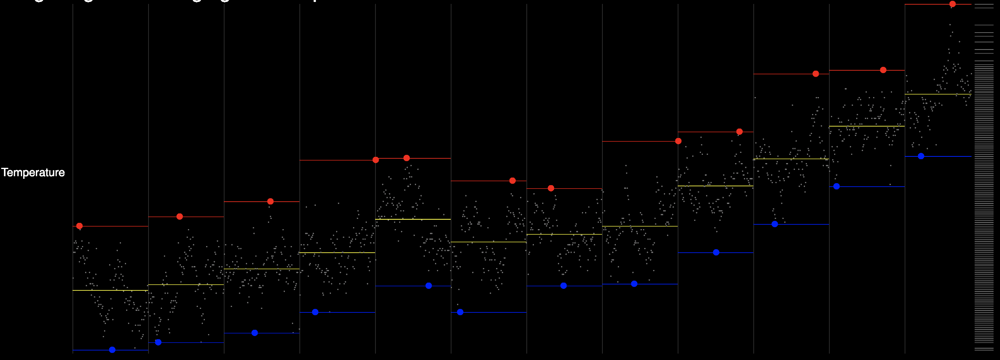
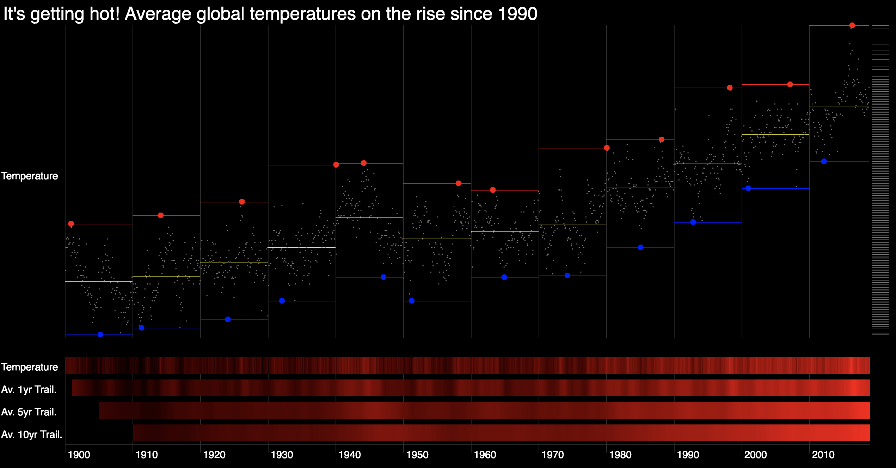
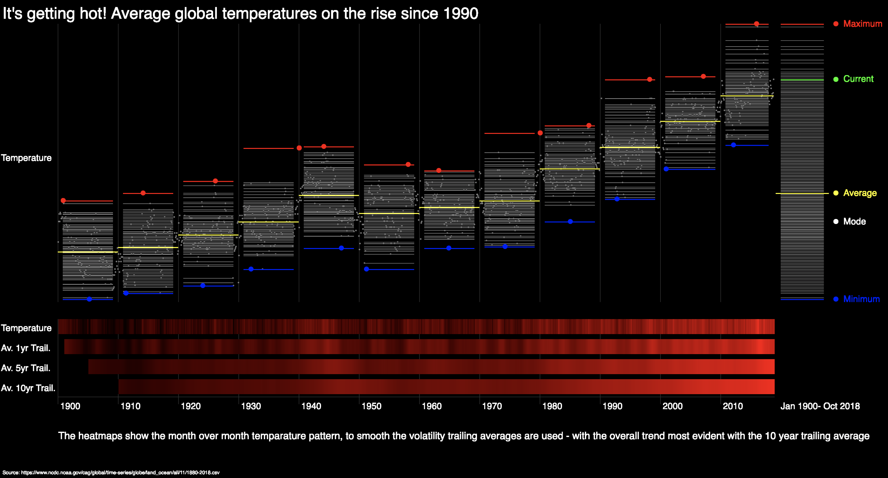

# Data Vis & Info Aesthetics - Final Assignment

## Overview - Global Weather Data

For the final assignment after a couple of false starts with various data sets, I decided to focus on global temperature data since January 1900.  I was able to get monthly data from the start date through the end of October 2018 with no data loss.  The data was sourced from [The National Centers for Environmental Information](https://www.ncdc.noaa.gov/cag/global/time-series/globe/land_ocean/all/11/1880-2018.csv).

### Initial Thoughts
Prior to creating any visualizations I undertook a series of calculations to try and find the most interesting story.  My initial focus was around two areas:
* **Forecasting the temperature series out:** After doing some research on this I decided this was too much of a rabbit hole and steered away from this at the end of the day
* **Correlation profiles between temperature and the trailing volatilities:**  My hypothesis was that in addition to average temperatures getting higher that the volatility of temperature changes would also go up, showing not only higher temperatures but also higher uncertainty around that.  Unfortunately, this didn't work out - instead the volatility throughout the time series remained pretty constant over time, with a non statistically significant relationship

#### Direction
After investigating and presenting some ideas in the second last week, I refocused on a more simple analytical approach, and instead laid the entire time series on one horizontal axis.

Similar to assignment 2, given the heavier data manipulation I performed most calculations including generating the P5 code in Excel - this results in the code looking exceptionally long versus if I wrote it directly in the console. I have included the Excel file in the data folder.

I initially created two main panels on the screen.

#### Panel 1 - Decade Segmented Time Series
In the first panel presented below I showed how the temperature evolved over the 118 period, and then partitioned the time series with light gray grid to separate each of the decades.  I then showed the average temperature in that decade with a yellow line across the length of the decade, and supplemented this by showing the highest and lowest temperature in that decade with a red and blot dot and line combination respectively.

The final portion of this panel includes a minimalist histogram on the far right hand side of the panel.  The slight right skew (high) is evident.

However, with this said the transparency on the histogram wasn't working the way I anticipated and I ended up creating a new approach discussed below that worked much better.

#### Panel 2 - Temperature Heatmap
In the second panel I focused on showing how the temperature evolved overtime.  On a MoM basis there was quite a big of movement between the months (the MoM were normally distributed), this then meant that the change across the time axis showed a decent amount of visual movement or noise and in many ways mitigated the overall message of the visualization.

To overcome this I included three additional heatmaps:
* 1 Year trailing average
* 5 Year trailing average
* 10 Year trailing average

The inclusion of these additional visualizations presented a stronger pattern. As expected the longer the averaging pattern the stronger the story of temperature increase.  A copy of the second panel is detailed below:

Overall, I was quite happy with how the heatmap panel came out, and I found presenting a story to the differences between the lines relatively easy (my test of a visualization is to practice presenting it aloud - I find that this highlights a variety of issues in the overarching story, labeling etc)

#### Bringing It Together
While Panels 1 and 2 were designed independently I wanted to combine them together to minimize the need for multiple axis. After combining the two panels the visualization became:

The initial combined visualization is concept-1.

### Improvements and Final Version
Following our conversation in the last session, I was focused on solving three main issues:

* **Quality of the DNA histogram:**  As discussed above the method of stacking semi transparent rectangles to create the DNA histogram wasn't working as I had hoped.  Accordingly, I instead created a traditional histogram using each pixel as a bucket.  Rather than stacking multiple rectangles to get the effect, I instead used the bucket score to set the color profile of the rectangle for each of the respective vertical pixels on the chart.  Overall I was happy that this came out as I had sketched
* **Utilizing the same DNA format for each of the decades:** In our last discussion we had agreed to try and use the same DNA charts that the overall period had for each of the decades. I used the same format as the new revised end DNA chart to achieve this - albeit the color mapping was normalized to data in each respective decade (I did try using the same color mapping, but it visually muted the results).  However, there were a series of small visual improvements that were needed when applying across the decades.  For instance, when taking the lines to the extremes of the decade vertical axis things started to look unclean, hence I narrowed the lines to emphasize that the lines represent that decade only.  Secondly I narrowed the maximum and minimum lines also while maintaining the average line width. This started to look like more of a statistical diagram which I was happy with given the quantum of data.  Finally I added back the pin markers for each observation to enable the user to connect the end DNA histogram to the heatmaps
* **Labeling:**  In the above version there wasn't really any labelling that would serve to help the user interpret the chart.  I implemented some light labeling for the top panel which I think came out cleanly, and then also added an interpretation note for the heatmap panel at the bottom of the visualization

A copy of the final visualization is contained below:

The final presentation is concept-2.

## Final thoughts
Overall after overcoming a couple of false starts with data, I am really happy with how the project came out.  While I originally designed the visualization with three major components - two in Panel 1 and then one in Panel 2, I feel like the final design actually created more value - for me the implementation of the DNA charts in each of the decades make that feel much more like a small multiples approach.  

Presenting aloud to the visualization passed a number of tests and I was able to operate on both a zoomed out and zoomed in level which I feel is critical.  I also had two other friends who present a lot of visualizations take it for a test drive and both reported that it was easy to present to.  This is definitely a design template that I will look to leverage professionally in the future.
