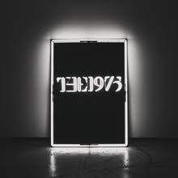
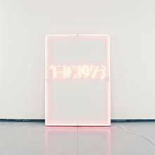
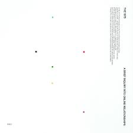

## free form
### caitlyn ralph

#### what's in this folder

1. Initial ideas in `ideas.md`

2. Data source ideas in `datasources.md`

3. Proposals of three ideas in `proposals.pdf`

4. Initial sketches of chosen ideas in `series_sketches_1.jpg`

#### data process

1. Downloaded the lyrics of each song by the 1975 using the Genius API and Lyricist npm library (in `data.js`).

2. Manually cleaned songs 
- deleted irrelevant ones, i.e.—ones from their forthcoming album that don't have lyrics uploaded yet ("Anybody Willing To Listen"), instrumentals ("12"), and live songs ("A Change of Heart (Live From The O2, London)")
- in `thrown_out` and stored in `not used` folder

3. Python notebook for textual analysis (`textual-analysis.ipynb`)
- N-grams were computed first on the entire corpus of lyrics. The songs were then categorized by album, and n-grams were computed for each album of lyrics.
- I originally used an nltk n-gram library, but it tokenized the words wrong (in particular, it was separating "gonna" and "wanna" into two word, which show up frequently in the lyrics)
- but then I used this great n-gram tutorial instead to do it with Python and no external libraries: https://www.techcoil.com/blog/how-to-generate-n-grams-in-python-without-using-any-external-libraries/ 
- TF-IDF was computed again first on the entire corpus and then on each album individually.
- Shout out to this awesome TF-IDF tutorial: http://www.ultravioletanalytics.com/blog/tf-idf-basics-with-pandas-scikit-learn

4. Python notebook for audio analysis (`audio-analysis.ipynb`)
- For the audio analysis, I used the features included in Spotify's <a href="https://developer.spotify.com/documentation/web-api/reference/tracks/get-several-audio-features/">API</a>.
- The available features are: danceability, energy, key, loudness, mode, speechiness, acousticness, instrumentalness, liveness, valence, tempo
- I first needed to create a CSV of all of the Spotify track IDs of each song (see `spotify-ids.csv`)
- I then hit the API for the audio features of each track with those IDs (see `audio-features.csv`).

5. Manually gathered popularity
- After a ton of research, I found out the only way to gather Spotify play counts for tracks is to manually use the desktop app and record for each song, which is what I did (see `popularity.csv`). 

#### design inspiration

